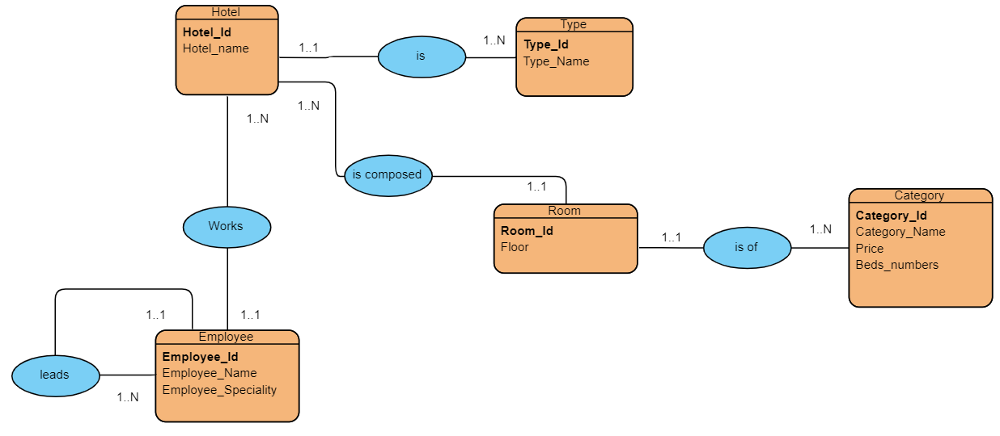
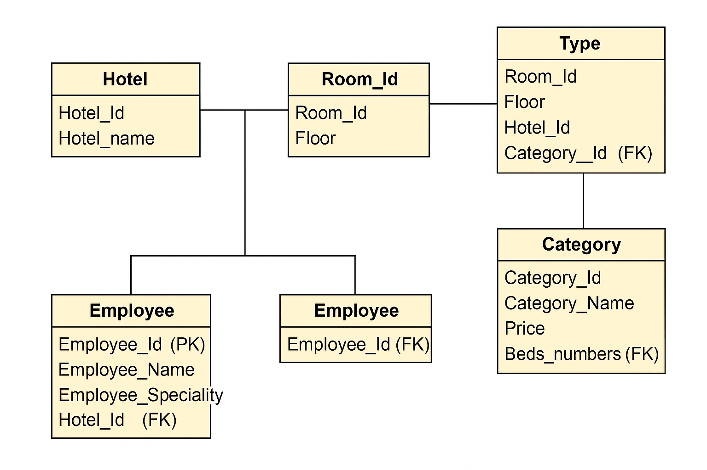

# 🏨 Hotel Management Database – Relational Model

Instructions

Convert the  entity relationship model to a relational diagram
This repository contains the relational model derived from a hotel management entity-relationship diagram. It supports the organization of data for multiple hotels, their rooms, employees, types, and categories.

>  What You're Aiming For

> In this checkpoint, you're going to practice with a real life example.

> After the construction of his hotels in one of the tourist areas, a director wishes to prepare a database to facilitate the management of his data.

> The director has presented the following information to you through the entity relationship model.

> https://i.imgur.com/oHkrfiJ.png
---

## 📘 Scenario

After building several hotels in a tourist area, a hotel director wishes to build a relational database to improve data management. The structure was designed based on the provided ER model.

---

## 🧩 Relational Schema

### 🏢 Hotel
- `Hotel_Id` (PK)
- `Hotel_Name`

### 🧑‍💼 Employee
- `Employee_Id` (PK)
- `Employee_Name`
- `Employee_Speciality`
- `Hotel_Id` (FK → Hotel)
- `Leader_Id` (FK → Employee.Employee_Id) ← self-referencing (leads)

### 🛏 Room
- `Room_Id` (PK)
- `Floor`
- `Hotel_Id` (FK → Hotel)
- `Type_Id` (FK → Type)
- `Category_Id` (FK → Category)

### 🧾 Type
- `Type_Id` (PK)
- `Type_Name`

### 🗂 Category
- `Category_Id` (PK)
- `Category_Name`
- `Price`
- `Beds_Numbers`

---

## 🖼️ Relational Model Diagram

Below is the relational model visualized:

> 💡 Each box represents a table, with **primary keys (PK)** and **foreign keys (FK)** labeled. Arrows show relationships between the entities.

---

## ✅ Notes

- One hotel has many rooms and employees.
- Each room belongs to one type and one category.
- An employee may lead other employees (self-referencing FK).
- All many-to-one and one-to-one relationships are resolved through foreign keys.
